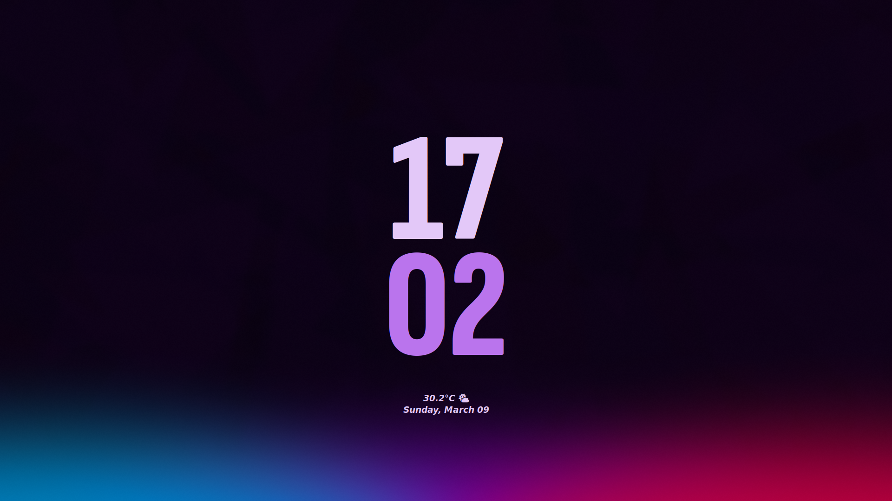
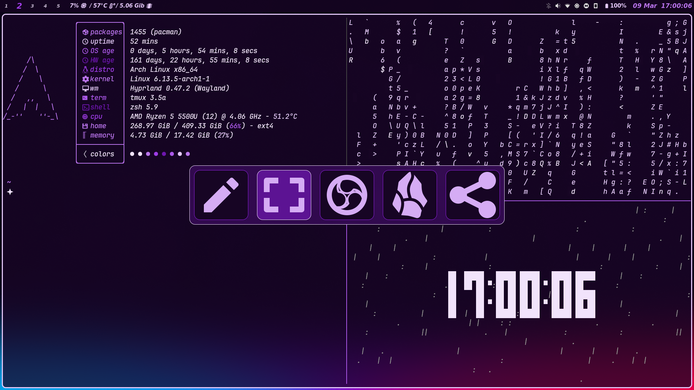
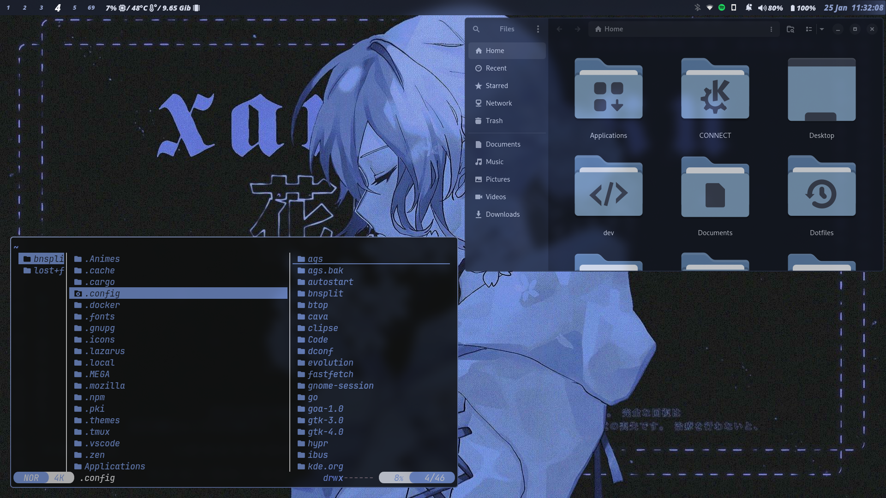
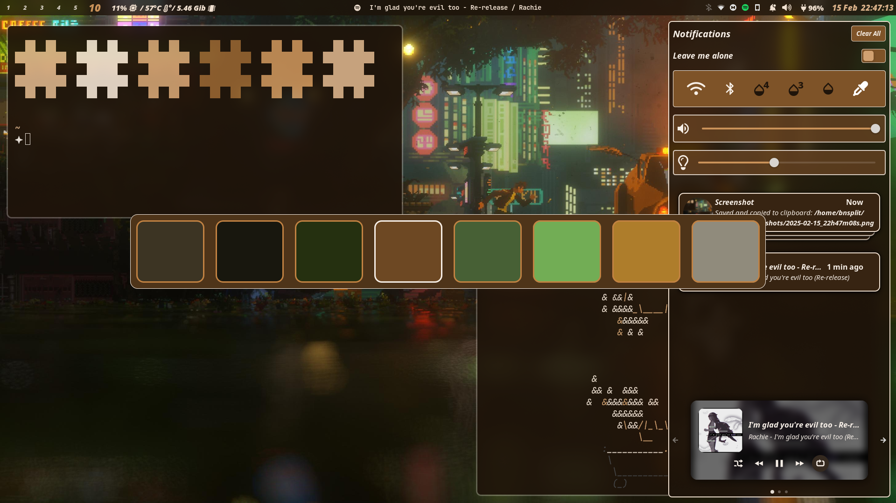
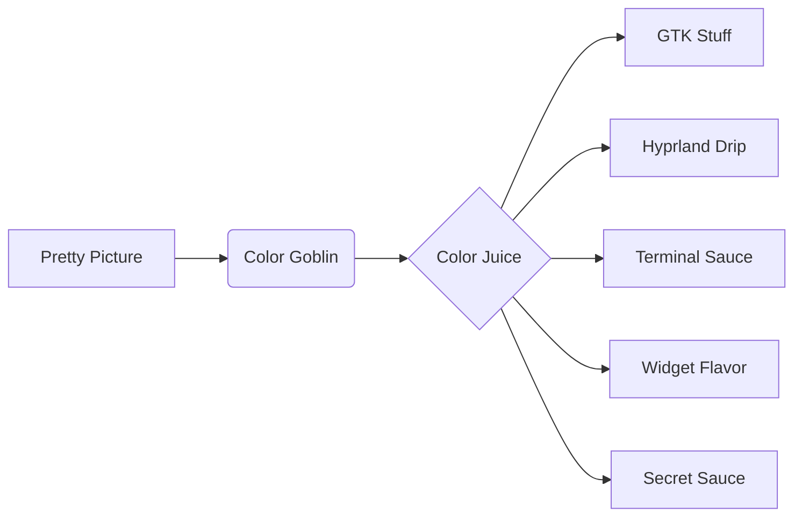

<div align="center">
  <h1 align="center">🌀 BnSplit's Dotfiles</h1>
  <p align="center">Hyprland Habitat Where Wallpapers Wage War on Blandness</p>

  
  [](./screenshots)
</div>

---

## ✨ **Chromagic Engine**
My wallpaper becomes the puppet master of your eyeballs:

> "One wallpaper to rule them all,  
> One hue-picker to bind them,  
> And to the darkness bind them  
> (until you change wallpapers again)"
>
> - Not J.R.R. Tolkien

---

## 🛠 **Toolbox of Tomorrow**
| Weapon of Choice   | Murder Function          | 
|---------------------|--------------------------|
| `Hyprland`          | Your favorite compositor |
| `Neovim`            | LazyVim++ with coffee    |
| `Astal (AGS)`       | Widgets that widget      |
| `Waybar`            | Pretty system gossip     |
| `Kitty`             | Terminal go brrrrrr      |
| `ZSH`               | Prompt witchcraft        |

---

## 🎨 **Screenshot Circus (20 Acts)**
<div align="center" style="column-count: 2; column-gap: 20px;">
  
  
  
  
  <!-- ... continue through 20 screenshots -->
  
</div>

---

## ⚡ **For the Impatient**
```bash
git clone --depth=1 https://github.com/BnSplits/Bn-Dotfiles.git
cd Bn-Dotfiles/Scripts
./setup.sh  # Say yes to everything like in the movies
```

---

## 🧠 **Color Mind Control Diagram**


---

## 📜 **Legalese Boogaloo**
[MIT Licensed](./LICENSE) - Take it, break it, fix it, just don't blame me!

*"This setup contains approximately 42% black magic. May cause spontaneous theming addiction and irrational hatred of static color schemes."*
