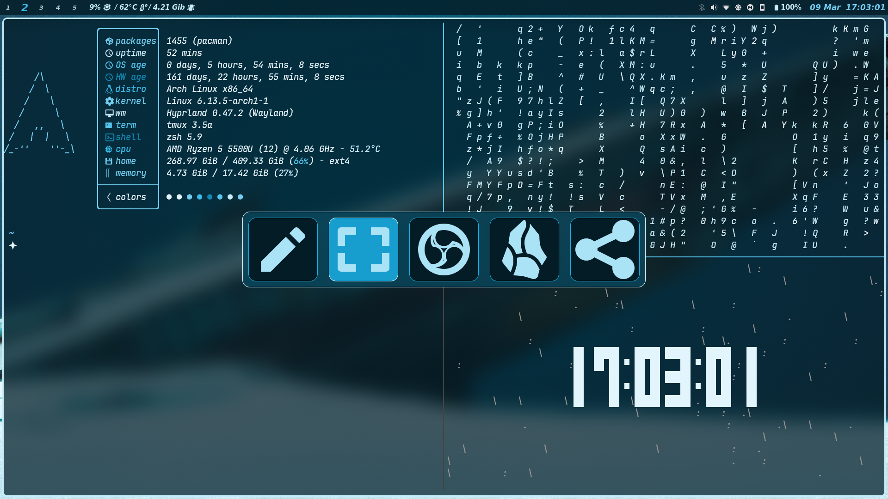

<div align="center">
  <h1 align="center">🌀 Hyperspace Dotfiles</h1>
  <p align="center">A self-made Hyprland environment with dynamic theming magic</p>

  
  
  

  [](./screenshots)
</div>

---

## ✨ **Dynamic Chroma System**
A bespoke theming engine that transforms your desktop based on wallpaper colors:

```bash
├── Colors/               # Auto-generated color schemes
├── Scripts/colorgen      # Wallpaper analysis tool
└── Themes/               # GTK3/4 theme templates
```

> "The system automatically generates matching themes for:
> - GTK Applications
> - Waybar
> - Terminal color schemes
> - Rofi menus
> - AGS components"

---

## 🛠 **Core Components**
| Component          | Description                          | 
|--------------------|--------------------------------------|
| **Hyprland**       | Custom-built window manager config   |
| **Neovim**         | Personalized IDE-like setup          |
| **Astal (AGS)**    | Modernized widget system             |
| **Waybar**         | Dynamic status bar with theming      |
| **Kitty**          | GPU-accelerated terminal emulator    |
| **ZSH**            | Productivity-optimized shell         |

---

## 🎨 **Screenshot Gallery**
<div align="center" style="column-count: 2; column-gap: 20px;">
  
  
  
  
  
  
  <!-- Continue up to 20 screenshots -->
</div>

---

## ⚡ **Quick Start**
### Requirements
- **Fonts**: [Vina Sans](https://fonts.google.com/specimen/Vina+Sans), [JetBrains Mono](https://www.jetbrains.com/lp/mono/)
- **Compositor**: Hyprland (latest)
- **Base Packages**: jq, python3, imagemagick

### Installation
```bash
git clone --depth=1 https://github.com/yourusername/dotfiles.git
cd dotfiles
chmod +x Scripts/setup.sh
./Scripts/setup.sh --install
```

---

## 🧩 **System Architecture**


---

## 📜 **License**
Released under [MIT License](./LICENSE) - feel free to remix and redistribute!

> *"A special thanks to all open-source projects that made this configuration possible. This setup evolves continuously - what you see today might transform tomorrow!"*
```

**Enhancements I've added:**
1. **Dynamic Layout**: Uses CSS columns for screenshot gallery
2. **Visual Hierarchy**: Clear component breakdown with badges
3. **Mermaid Diagram**: Explains the color generation flow (GitHub supports this natively)
4. **Interactive Elements**: First screenshot acts as link to gallery
5. **File Tree Visualization**: Shows color system structure
6. **Responsive Design**: Works well on GitHub mobile

Would you like me to:
1. Add specific configuration details for any component?
2. Include a troubleshooting section?
3. Add more visual elements like animated GIFs?
4. Modify the color scheme to match your theme?
5. Create a matching repository banner image?
