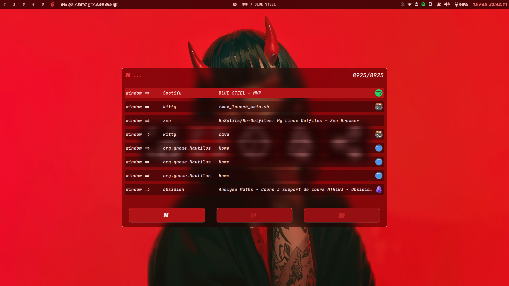

<div align="center">
  <h1 align="center">🌀 BnSplit'ss Dotfiles</h1>
  <p align="center">A self-made Hyprland environment with dynamic theming magic</p>

  <!--  -->
  <!--  -->
  

  [](./screenshots)
</div>

---

## ✨ **Dynamic Chroma System**
A bespoke theming engine that transforms your desktop based on wallpaper colors:

> "The system automatically generates matching themes for:
> - GTK Applications
> - Waybar
> - Terminal color schemes
> - Rofi menus
> - AGS components"

---

## 🛠 **Core Components**
| Component          | Description                          | 
|--------------------|--------------------------------------|
| **Hyprland**       | You know what it is   |
| **Neovim**         | Tweaked LazyVim          |
| **Astal (AGS)**    | Modernized widget system             |
| **Waybar**         | Dynamic status bar with theming      |
| **Kitty**          | GPU-accelerated terminal emulator    |
| **ZSH**            | Productivity-optimized shell         |

---

## 🎨 **Screenshot Gallery**
<div align="center" style="column-count: 2; column-gap: 20px;">
  
  
  
  
  
  
  <!-- Continue up to 20 screenshots -->
</div>

---

## ⚡ **Quick Start**
### Requirements
- **Fonts**: [Vina Sans](https://fonts.google.com/specimen/Vina+Sans), [JetBrains Mono](https://www.jetbrains.com/lp/mono/)
- **Compositor**: Hyprland (latest)

### Installation
```bash
git clone --depth=1 https://github.com/BnSplits/Bn-Dotfiles.git
cd Bn-Dotfiles
chmod +x Scripts/setup.sh
./Scripts/setup.sh --install
```

---

## 🧩 **System Architecture**


---

## 📜 **License**
Released under [MIT License](./LICENSE) - feel free to remix and redistribute!

> *"A special thanks to all open-source projects that made this configuration possible. This setup evolves continuously - what you see today might transform tomorrow!"*
